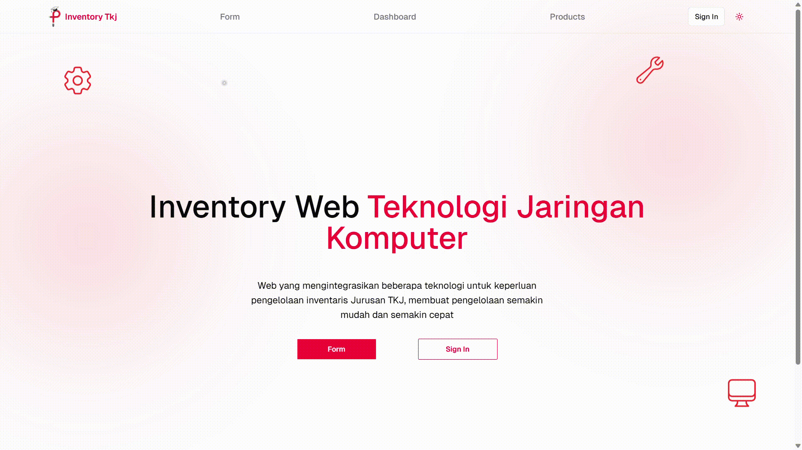
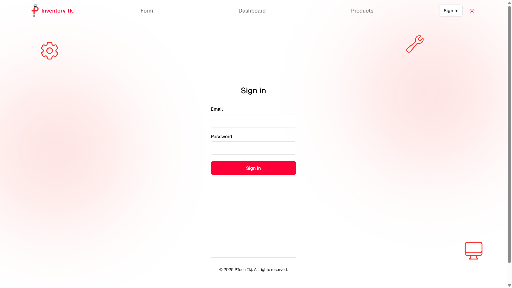
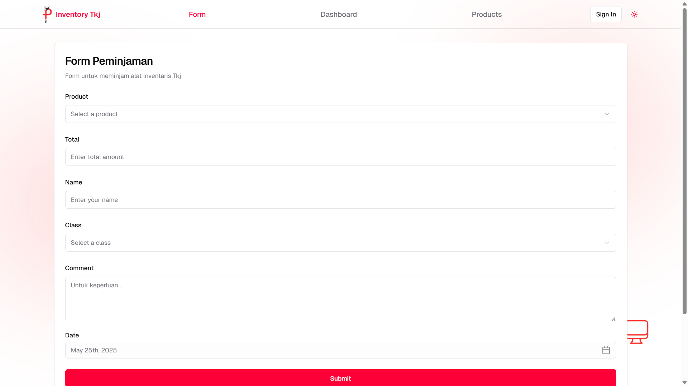
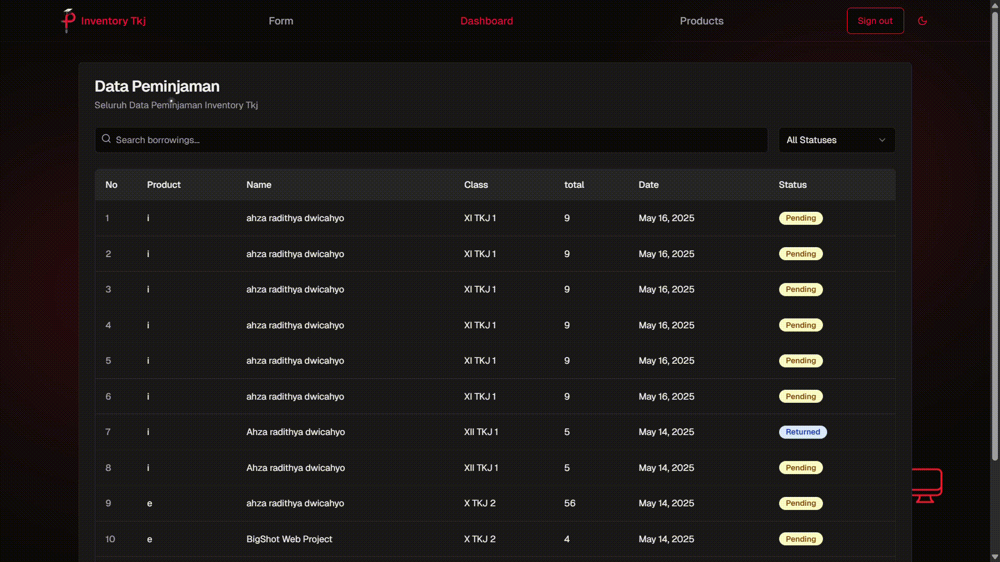

# 📦 SMKN 2 Cikarang Barat Inventory System

View the live project at 👉 [pengkolantech.site](https://pengkolantech.site)

## 📊 Overview

This project is developed by me to **SMKN 2 Cikarang Barat** to manage school inventory data in real-time using modern web technologies.  
Built with **Next.js** and **Supabase**, the system allows admins to track borrowings, confirm or reject requests, and view inventory status—all in a clean, responsive dashboard.

🎞️ Below is a quick look at the user experience:

### Home Page

### Sign In Page

### Form Page

### Borrowings Page

### Products Page


---

## 🚀 Getting Started

Run the development server:

```bash
npm run dev
# or yarn dev
# or pnpm dev
# or bun dev
```

Before running, make sure to add the following environment variables to your `.env` file:

```env
NEXT_PUBLIC_SUPABASE_URL=
NEXT_PUBLIC_SUPABASE_ANON_KEY=
```

Then, open http://localhost:3000 in your browser. Feel free to reach out with any questions!
